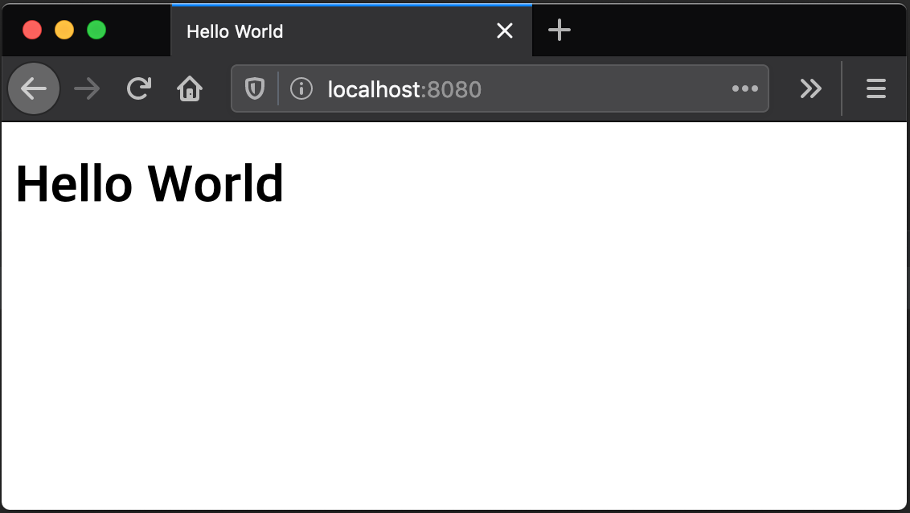
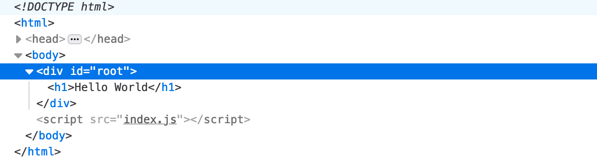
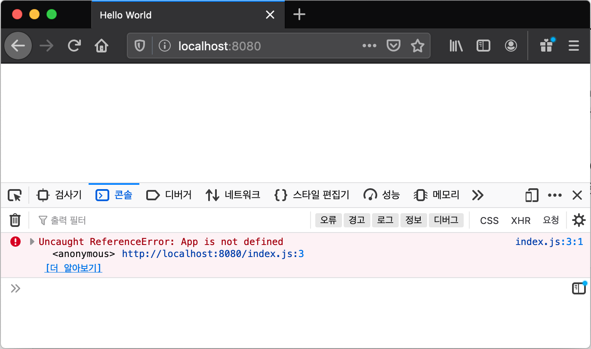
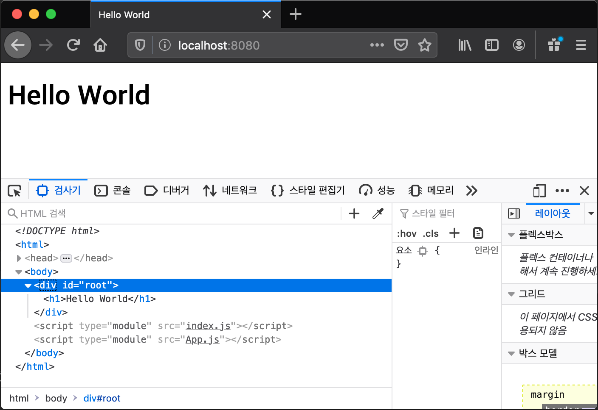
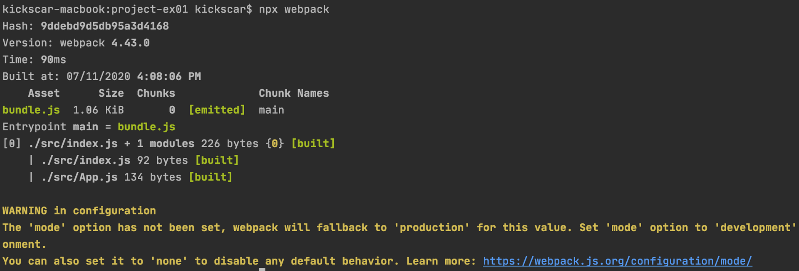
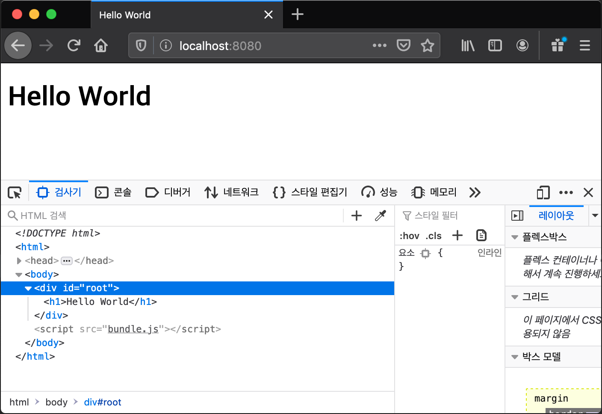

01.Refactoring

## 00. Dev Tools
1.	VSCode
	-	ESLint
	-	Guides
	-	Relative Path
	-	Reactjs code snippets
2.	Browser Extensions
	-	react-detector
	-	show-me-the-react
	-	React Developer Tools (리액터 엘리먼트를 볼 수 있다.)	

## 01\. DOM API 기반 애플리케이션

React 애플리케이션 작성 전에 브라우저 DOM을 직접 조작하는 예제를 먼저 작성해 본다. ch01 실습들은 이 예제와 같은 기능의 React 애플리케이션으로 리팩토링해 가는 실습들이다. 이 리팩토링 과정을 통해 전통적인 DOM 조작 애플리케이션과 React 기반 애플리케이션의 차이점을 이해할 수 있을 것이다.

#### 1\. 애플리케이션 작성

##### 1.1 public/index.html

```html

<!DOCTYPE html>
<head>
	<meta charset='utf-8'>
	<title>Hello World</title>
</head>
<body>
	<div id='root'></div>
	<script src='index.js'></script>
</body>

```

​ 코드는 간단하다. id가 'root' 인 `div` 만 있고 index.js 파일이 다운로드 되어 JavaScript 코드가 실행된다.

##### 1.2 public/index.js

```JavaScript
const App = function(){
	const app = document.createElement('h1');
	app.textContent = 'Hello World';
	return app;
}

document
	.getElementById('root')
	.appendChild(App());
```

​ ES6 문법으로 작성 되어 있는 간단한 Browser `DOM API` 를 호출하는 코드다. 브라우저에서 실행되기 때문에 ES6 브라우저 호환성을 체크해 보아야 한다. [ECMAScript compatibility table](https://kangax.github.io/compat-table/es6/)를 보면 대부분 브라우저는 ES6를 완벽히 지원하는 데, IE11만 부분적 지원을 한다. 하지만 예제 코드 정도는 IE11에서도 지원 가능한 ES6 코드이기 때문에 하위 트랜스파일링은 필요없다.

1. App 함수는 `&lt;h1&gt;Hello World&lt;h1&gt;` HTMLElement 객체를 생성해 반환한다.

2. 브라우저에 로딩된 index.html의 id 'root'인 Element를 찾아 App() 함수가 반환한 HTMLElement를 자식으로 추가한다.

#### 2\. Express 서버 작성 및 실행

​ 로컬에서 index.html를 브라우저에 로딩하여 예제를 실행시켜도 좋지만 간단한 Node.js 기반 웹 서버를 작성하고 실행하여 네트워크로 접근하도록 한다.

##### 2-1 프로젝트 초기화

1. project-ex01 매니페스트 파일 생성

```bash

$ cd project-ex01

$ npm init -y

```

2. express 패키지 설치

```bash

$ npm i -D express

```

##### 2-2 server.js

1. 코드 작성

```javascript
import * as path from 'path';
import express from 'express';

var app = express();

app.use('/', express.static(path.resolve('.', 'public')));
app.listen(8080, function() {
	console.log('starts server on port 8080');
})
```

​ 코드는 ES6 Module 시스템을 사용한다. Node는 v14+ 부터 이를 지원하지만 디폴트로 지원하지 않기 때문에 간단한 설정을 한다. 프로젝트 매니페스트 파일 package.json에 다음 섹션을 추가하면 Node는 프로젝트의 모든 js 파일을 ES6 모듈로 인식한다.

```json

"type": "module"

```

2. 실행

```bash

$ node server

starts server on port 8080

```

3. 확인


​

#### 3.결론

​ 브라우저는 로드된 HTML문서를 파싱하여 DOM을 구성하고 JavaScript 코드로 DOM API를 호출하여 DOM에 노드를 추가, 수정 및 삭제 등의 업데이트를 한다. DOM이 변하면 브라우저는 화면을 다시 렌더링하고 사용자는 동적으로 변화되는 화면을 볼 수 있는 전통적인 프론트엔드 프로그래밍 방식으로 간단하게 예제를 작성해 보았다.

​ 다음은 index.html에 없던 h1 Element가 동적으로 추가된 DOM 구조이다.



​ DOM API를 직접 JavaScript 코드로 호출하는 방법도 있지만 보통은 jQuery와 같은 DOM의 노드 선택 그리고 조작에 특화된 JavaScript 라이브러리를 사용한다. 라이브러리를 사용해도 브라우저 DOM을 직접 조작하는 것은 변함없다. 이 방식은 작성된 실행 코드 전달이 쉽고(작성한대로 js파일에 담아 html에 링크) 오랫동안 축적해온 프로그래밍 경험, 안정적이고 검증된 라이브러리 또는 MVC아키텍처에 기반한 프레임워크들이 존재하기 때문에 그 수명은 당분간 지속될 것이다.

​ 다음은 하나의 파일에 있는 JavaScript 코드를 여러 파일로 분리한다. 애플리케이션이 커지거나 중복되는 코드가 있으면 별도의 파일에 코드를 작성하고 여러 파일에서 재사용 하도록 작성하는 것이 바람직하다. 이 여러 파일을 모듈이라 하는데 방금, 모듈에 대한 기초적 개념을 언급하였다. 보통, 규모가 큰 애플리케이션 작성을 위해 프로그래밍 언어가 반드시 지원해야 하는 기능으로 ch01-02, ch01-03에서 JavaScript 모듈 지원에 대해서 살펴본다.


---
## 02\. 애플리케이션의 분리
 
 복잡한 애플리케이션은 코드를 분리하여 개발하는 것이 바람직하다. 실습 예제는 애플리케이션 코드를 여러 js파일로 옮기는 단순한 방식으로 분리한다. 이 방식은 전통적인 JavaScript 웹 애플리케이션 들에서 볼 수 있는 분리 방식이지만 여러 문제점을 가지고 있다. 실습 예제는 애플리케이션이라 하기에 민망할 정도로 단순하지만 이 분리 방식의 문제점을 언급하고 이해하기에는 충분하다.

#### 1\. 애플리케이션 작성

##### 1.1 public/index.html

```html
<!DOCTYPE html>
<head>
	<meta charset='utf-8'>
	<title>Hello World</title>
</head>
<body>
    <div id='root'></div>
    <script src='App.js'></script>
    <script src='index.js'></script>
</body>
```

​ ch01-01의 예제와 애플리케이션 자체는 완전 동일하다. 다른 것은 JavaScript 코드를 App.js와 index.js로 분리 하였기 때문에 js파일 링크가 두 개 있다.

##### 1.2 public/index.js

```JavaScript
document
    .getElementById('root')
    .appendChild(App());
```

​ ch01-01의 예제와 애플리케이션 기능은 같지만 코드 분리가 목적이기 때문에 App() 함수만 App.js로 분리하고 나머지 코드는 남겼다.

##### 1.3 public/App.js

```JavaScript
const App = function(){
    const app = document.createElement('h1');
    app.textContent = 'Hello World';
    return app;
}
```

​ index.js에 있던 App() 함수 정의 코드를 단순히 App.js로 분리했다.

#### 2\. Express 서버 작성 및 실행

​ 앞의 ch01-01의 예제와 같다.

##### 2-1 프로젝트 초기화

1.  project-ex01 매니페스트 파일 생성
    
    ```bash
    $ cd project-ex01
    $ npm init -y
    ```
2.  express 패키지 설치
    
    ```bash
    $ npm i -D express
    ```

##### 2-2 server.js

1.  코드 작성
    
    ```javascript
    import * as path from 'path'; 
    import express from 'express';
    
    var app = express();
    
    app.use('/', express.static(path.resolve('.', 'public')));
    app.listen(8080, function() {      
      console.log('starts server on port 8080');
    })
    ```
    
    ​ ES6 Module 시스템 지원(package.json)
    
    ```json
        "type": "module"
    ```
2.  실행
    
    ```bash
    $ node server
    starts server on port 8080
    
    ```
3.  확인
    
	

#### 3.결론

​ 단순한 코드 분리를 한 애플리케이션도 문제 없이 작동하는 것 처럼 보인다. 하지만, index.js 파일이 App.js 보다 먼저 브라우저에 로딩되면 문제가 발생한다. index.html에 기술한 순서가 js 파일 로딩 순서를 보장하지 않음을 알아야 한다. 파일 크기의 차이, 웹 서버와 네트워크 상태등 순서를 보장할 수 없는 요인들은 많다. (대부분 브라우저는 한 문서 안의 js, css, 이미지 등 외부 자원들의 로딩은 개별 쓰레드로 동작한다.)

​ 어찌 어찌하여 순서를 보장한다 해도 개발 과정에서의 문제점은 여전히 남아 있다. 예제는 단순 해서 파일간의 의존성이 명확하지만 애플리케이션이 조금만 커지고 복잡해져 분리 파일이 많아지면 의존성 관리 자체가 불가능 하거나 만만치 않다. 다음은 index.html에 js 파일의 순서를 강제로 바꿔 테스트 해 본 결과다.

##### 3.1 public/index.html

```html
<!DOCTYPE html>
<head>
<meta charset='utf-8'>
<title>Hello World</title>
</head>
<body>
    <div id='root'></div>
    <script src='index.js'></script>
    <script src='App.js'></script>
</body>
```

##### 3.2 결과



​ index.js 가 먼저 로딩되어 실행되면,

```javascript
document
    .getElementById('root')
    .appendChild(App());
```

​ 이 코드의 실행 시점에서는 App 함수가 정의되지 않아 에러가 발생한다. 이 문제를 해결하기 위해서는 로딩 순서에 상관 없이 각 파일(모듈)의 의존성을 보장해 주는 것이 필요하다. 이 것만 해결되면 복잡한 애플리케이션 구조적 분리의 설계 문제만 집중 할 수 있다. 다음에서는 `JavaScript 모듈 시스템` 을 언급하는데 이 문제를 해결한 바로 `ES6 모듈 지원` 이다.


---
## 03. ES6 모듈 기반 애플리케이션
 모듈은 다른 JavaScript 파일에서 쉽게 불러 쓸 수 있는 재사용 가능한 코드(함수, 클래스, 객체, 상수, 변수 등)들을 가리킨다. JavaScript가 브라우저 밖으로 나와 범용 애플리케이션 작성이 가능하기 위해서는 코드를 분리하여 관리하고 재사용할 수 있는 모듈 시스템을 언어가 지원해야 했다. ES6 이전에는 외부 라이브러리(CommonJS 또는 AMD)의 모듈 지원을 활용 했었지만 ES6 부터는 자체 모듈 지원 표준이 마련되었다.
 
 Node는 v14+ 부터 CommonJS 모듈 지원에서 ES6 표준 모듈 지원으로 교체했다. 이미 ch01-01에서 server.js 코드를 작성하면서 확인했지만 서버 사이드 뿐만 아니라 ES6 표준 모듈을 지원 브라우저가 점점 늘어나 대부분 브라우저가 지원하고 있는 상황이다. 따라서 복잡한 프론트엔드 애플리케이션도 ES6 표준 모듈 시스템 지원에 따라 분리 개발이 원칙적으로 가능하다.

#### 1. JavaScript 모듈 지원: project-ex01

##### 1-1. src/App.js module

```javascript
export const App = function(){
    const app = {};
    app.textContent = 'Hello World';

    return app;
};
```

​	ES6 모듈 지원에서는 각각의 모듈을 js 파일 단위로 저장한다. 쉽게 말해, js파일 하나가 모듈이라 보면 된다. 모듈 내부의 함수, 클래스, 객체, 상수, 변수 등은 export 키워드를 통해 외부에 노출하는데, 노출 방법은 여러 객체를 노출하거나 하나의 객체를 노출하는 두 가지 방법으로 나눌 수 있다. 예제는 함수 하나만 export 하고 있지만 여러 객체를 노출하는 방법을 사용하고 있다. 

​	앞에서 웹 애플리케이션 분리로 App.js와 index.js 두 모듈을 작성했다. 이 예제는 ES6 모듈을 테스트 하는 Node 기반 애플리케이션으로 브라우저에서 동작하는 애플리케이션이 아니다. 그래서 DOM API를 사용하여 HTMLElement 객체를 생성하는 대신 Object 타입 객체 `{}` 생성으로 바꿨다.     

##### 1-2. src/index.js module

```javascript
import  { App } from './App.js';

console.log(App());
```

​	index.js 에서 외부 모듈 App.js 모듈이 노출한 객체를 참조하기(불러오기) 위해 import 키워드를 사용했다. App.js 모듈이 다수의 객체를 하나의 객체에 담아 노출하는 export 방식이기 때문에 import 에서는 `ES6 객체 분해` 문법을 사용해서 하나의 객체 안에 노출된 여러 객체 중 불러올 특정 객체들을  `{}` 안에 지정한다. App.js 에서 노출된 객체는 App 함수밖에 없기 때문에 예제 index.js의 import 구문에서는 `{}` 안에 App 함수만 지정했다.

##### 1-3. 실행 및 결과 확인

```bash
$ node src/index
{ textContent: 'Hello World' }
```

​	Node 백엔드 애플리케이션을 여러 모듈로 나누고 모듈에서 객체를 export하고 import하는 방법을 ES6 모듈 지원 방법으로 실습해 보았다. 이 예제는 동일한 호스트의 지정된 위치에 이미 해당 모듈이 존재하는 상태에서 동작하기 때문에 ES6 모듈을 작성하는 방법과 사용법만 살펴본 예제다.

​	하지만 백엔드가 아닌 프론트엔드 애플리케이션 모듈에서는 네트워크를 통한 개별 모듈들의 로딩 동기화를 고려해야 한다. ES6 모듈을 지원하는 브라우저는 모듈 로딩 동기화를 해결하고 보장해 주기때문에 신경 쓰지 않고 어떻게 애플리케이션을 모듈로 잘 분리하고 재사용 문제 즉, 설계 문제만 고민하면 된다. 예제 project-ex02에서 확인해 보자.         

#### 2. 브라우저 모듈 지원: project-ex02

##### 2.1 public/index.html

```html
<!DOCTYPE html>
<head>
	<meta charset='utf-8'>
	<title>Hello World</title>
</head>
<body>
    <div id='root'></div>
    <script type="module" src='index.js'></script>
    <script type="module" src='App.js'></script>
</body>
```

​	앞의 실습과 동일하게 index.js, App.js 두 js 파일(모듈)를 링크한다. 다른 것은 `type='module'` ES6 모듈 지원 설정이다. 백엔드 작성에서 package.json 설정의 `'type': 'moduel'` 과 유사하다. 브라우저가 모듈 의존성과 로딩 동기화를 테스트하기 위해 일부러 index.js 먼저 로딩하게 순서를 설정했다. 의존성을 무시한 단순한 JavaScript 파일 로딩이면 에러가 발생할 것이다.

##### 2.2 public/index.js

```JavaScript
import { App } from './App.js'
document
    .getElementById('root')
    .appendChild(App());
```

​	import 구문을 사용해서 App.js 모듈의 App 함수를 import 한다.

##### 2.3 public/App.js

```JavaScript
export const App = function(){
    const app = document.createElement('h1');
    app.textContent = 'Hello World';

    return app;
}
```

​	export 구문을 사용해서 App 함수를 외부로 노출한다.

##### 2.4 Express 서버 작성 및 실행

​	앞의 실습과 같다. 실습 프로젝트에서 복사하거나 앞의 실습의 'Express 서버 작성 및 실행' 부분을 참고하여 server.js 작성하고 실행하도록 한다.

```bash
$ node server
starts server on port 8080
```

​	브라우저로 접근해 보면 잘 작동하는 것을 확인할 수 있다.



#### 3. 결론

​	ES6 모듈 지원으로 백엔드 뿐만 아니라 프론트엔드 애플리케이션 개발에서도 모듈로 분리하여 개발이 가능하다는 것을 확인 하였다. 복잡한 프론트엔드 애플리케이션 개발도 원칙적으로 잘 정의된 모듈로 분리하여 개발이 가능하다.

​	하지만, 프론트엔드 애플리케이션이 수십에서 수백 개의 모듈로 분리될 경우, 브라우저에서 개별적으로 이 모듈들을 import하는 것은 상당히 비효율적이다. 뿐만 아니라 더 고려해 보아야 할 프로그래밍 모델 관점의 문제점도 있다. 프론트엔드 웹 애플리케이션은 JavaScript 이 외의 다양한 애셋(HTML, CSS, Image, Font)으로 구성되어 있기 때문에 JavaScript가 이 다양하고 많은 애셋들을 어떻게 다루어야 개발뿐만 아니라 실행시 로딩 동기화에 문제가 없는 가 하는 점이다. 

​	이 문제는 다양한 모든 애셋들을 JavaScript 모듈로 취급하는 추상화 작업과 하나의 js 파일(번들)로 묶어 브라우저에 전달하는 것으로 해결하고 있다. 하나로 묶은 번들의 사이즈가 커지는 것이 문제가 되지만 이는 코드 분할 및 지연로딩 방법으로 해결한다. 번들로 묶어 주는 도구로 grunt, gulp, webpack 등이 있고 특히, webpack은 모듈간의 의존성 분석을 통해 의존 관계의 모듈들만 하나의 번들로 만든다. 이런 특징으로 빌드 도구에서 큰 인기를 얻고 있다.  

​	webpack 모듈 의존성 기반 빌드(번들링)을 이용해 모듈로 잘 분리된 애플리케이션을 하나의 번들로 만들 수 있고 브라우저는 모듈 지원 여부와 상관 없이 이 번들만 다운로드 하면 된다. 최근 대규모 프론트엔드 애플리케이션 개발에는 webpack을 사용한 번들링이 필수처럼 되었다. 당연히 애플리케이션은 모듈로 잘 분리되어 개발되어 있어야 함을 전제로 한다. ES6 모듈 스펙을 이해하고 개발에 적용할 줄 알아야 하는 이유이다.

​	다음 실습에서는 webpack을 사용하여 모듈로 분리된 애플리케이션을 번들링하고 번들 파일을 브라우저에 전달해 애플리케이션을 실행해 볼 것이다.


---
## 04. 애플리케이션 번들링
 webpack을 사용하여 모듈로 분리된 애플리케이션 번들링 실습을 한다. 최근 브라우저들이 ES6 모듈을 지원하기 때문에 개별 분리된 모듈들을 html 문서에서 링크해도 원칙적으로 애플리케이션 실행에 문제는 없다. 하지만, 큰 규모의 애플리케이션이 많은 모듈로 작게 분리되면 html 파일에 개별적 모듈의 링크 작업이 어렵고 다운로드를 위한 브라우저와 서버 사이의 네트워크 연결도 큰 부담이다. webpack은 작게 분리된 많은 모듈들의 의존성을 분석하여 하나의 js파일로 묶는 도구이다. 쉽게 말하면, 애플리케이션을 개발할 때는 작은 모듈로 나눠 개발하고 배포를 위한 빌드에서 하나의 js파일로 묶는 것이다. 이 하나의 js파일을 번들이라 하고 묶는 작업을 번들링이라 한다. 번들링 도구는 webpack을 주로 사용하며 실습에서도 webpack을 사용할 것이다. 

 번들링은 모듈로 분리되어 있는 JavaScript 코드들의 의존성을 분석해 단순히 하나로 합치는 것 만을 의미 하지 않는다. 번들링 과정 안에는 JavaScript 코드의 난독화/압축(Uglify), 문법 체크를 위한 린팅(linting), 문서화 그리고 테스팅도 할 수도 있다. 애플리케이션의 빌드 과정이라 보면 된다. 번들링이라 부르는 것은 최종 결과물이 하나의 파일로 묶인 번들이기 때문이다.
 
 대부분 번들링 도구는 js 파일 만을 모듈로 취급하지 않는다. 하나의 웹 애플리케이션을 구성하는 JavaScript, css, html, image 등은 오래전 부터 강제적으로 기술 분리(다른 구현 언어)가 되어 있었다. 최근 번들링 기반의 빌드 도구들은 이 기술들을 분리 대상이 아닌 밀접한 연관성을 가진 모듈로 추상화 하는 경향이 있다. 쉽게 말해 JavaScript, css, html, image 라는 기술에 상관없이 하나의 웹 애플리케이션을 구성한다는 공통점으로 모듈로 취급하여 함께 번들링 한다는 말이다. 개발에서 해야 할 것은 의외로 쉬운데 import로 의존하고 있는 자원을 불러오면 된다. 마지막으로 번들링된 번들 파일이 브라우저에서 정상적으로 실행되기 위해서는 개발 단계에서 애플리케이션을 모듈로 잘 분리하고 잘 조직화 하여야 함을 전제로 한다.


1.	애플리케이션 작성

##### 1-1 src/index.js, src/App.js

​	앞의 실습과 동일하다. 이미 ES6 모듈 스펙에 맞춰 잘 분리했지만 다른 점은 모듈 소스들이 `src` 디렉토리에 있다는 것이다. 이 실습부터는 모듈 소스들을 번들링 하여  `public` 디렉토리에 번들 파일로 배포하는 과정이 있다. 개발할 때는 `src` 디렉토리에 모듈 소스로 애플리케이션을 분리하여 개발하고 배포 디렉토리 `public` 에는 index.html 그리고 번들 파일 bundle.js 가 있게 된다.   

##### 1-2  public/index.html

```html
<!DOCTYPE html>
<head>
	<meta charset='utf-8'>
	<title>Hello World</title>
</head>
<body>
    <div id='root'></div>
    <script src='bundle.js'></script>
</body>
```

​	bundle.js 에 대한 링크가 있다.

##### 1-3 public/bundle.js 번들링 하기

1. webpack 설치

   번들링을 위한 도구 webpack-cli, webpack 을 설치한다.

   ```bash
   $ npm i -D webpack-cli webpack
   ```

   ​	실제 번들링 관련 코어 패키지는 webpack 이다. webpack-cli는 webpack에 다양한 명령을 할 수 있는 CLI 도구들이 있는 패키지로 함께 설치한다. 

2. webpack.config.js

   webpack 패키지를 설치했다고 바로 번들링이 가능 한 것은 아니다. 모듈 소스의 위치, 번들링 될 번들 파일의 이름과 생성 위치 등을 설정해야 한다. 설정 파일의 이름은 webpack.config.js 이다.

   ```JavaScript
   const path = require('path');
   
   module.exports = {
       entry: path.resolve('src/index.js'),
       output: {
           path: path.resolve('public'),
           filename: 'bundle.js'
       }
   }
   ```

   ​	설정 파일의 import와 export 부분을 보면 ES6 표준 모듈 방식이 아니다. webpack 내부는 아직 ES6 표준 모듈을 지원하지 못한다. 따라서 설정 파일 모듈 문법은 ES6 이전의 모듈 지원에 사용했던 CommonJS 방식으로 import대신 require(..) 그리고 export 대신 module.exports를 사용해야 한다. 이와 함께 프로젝트 전역으로 ES6 모듈 사용 설정을 하지 말아야 한다. package.json 에 "type": "module" 을 추가하지 않는다.   

   ​	entry는 의존성 분석을 시작하는 시작 모듈이다. src/index.js 부터 import를 찾아가며 의존성 분석을 시작하고 발견된 모듈은 번들링 될 것이다. output에 지정한 번들 파일 이름 bundle.js를 설정 하였고 public 디렉토리를 생성 위치로 설정 하였다.  	  

3. 빌드하기(번들링)

   ​	빌드(번들링) 시작 명령은 webpack 이다. 이 명령은 옵션이 많은데 기본으로 번들링 한다.

	

   ​	번들링이 정상적으로 완료돠면 public 디렉토리에 bundle.js 가 생성된다.

#### 2. Express 서버 작성 및 실행

​	앞의 실습과 같다. 실습 프로젝트에서 복사하거나 앞의 실습의 'Express 서버 작성 및 실행' 부분을 참고하여 server.mjs 작성하고 실행한다. webpack 빌드를 위해 ES6 모듈 지원을 전역으로 하지 않았기 때문에 js 파일을 ES6 모듈로 실행 시키기 위해 확장자를 mjs로 변경했다.

```bash
$ node server
starts server on port 8080
```

​	브라우저로 접근해 보면 잘 작동하는 것을 확인할 수 있다.




#### 3. 결론

​	webpack을 사용하여 모듈로 분리된 애플리케이션을 번들링하고 배포해 보았다. 이 방법은 복잡한 프론트엔드 개발에서 사용되는 일반적인 방법이다. webpack 설정은 실습처럼 간단하지 않다. react와 같은 라이브러리를 이용해 프론트엔드 애플리케이션을 개발하고 css, image, font 등 외부 리소스까지 번들링 하고 개발 서버 구동과 빌드 배포를 위한 자동화된 스크립팅 까지 하려면 설정은 당연히 복잡해진다. webpack에 대한 자세한 설정은 [javascript-practice/ch02/07.Webpack:모듈 번들러](https://github.com/kickscar/javascript-practices/tree/master/ch02/07)를 참고한다.

​	물론, 설정을 자동화 하는 스크립트들과 도구들이 많이 있지만 이런 도구와 스크립트 도움없이 직접 개발 설정을 먼저 이해하고 시간과 귀챦음을 줄이기 위한 설정 스크립트와 도구 사용을 추천한다.

​	모듈과 webpack 기본 내용을 지금까지 실습에서 살펴 보았다. 이제 반응형 UI 렌더링 엔진(Virtual DOM 조작) 기반의 애플리케이션으로 리팩토링 할 기초적인 준비가 되었다. 반응형 UI 렌더링 엔진은 React 라이브러리를 사용할 것이다.

​	프론트엔드 애플리케이션 개발에서 왜 굳이 브라우저 DOM API의 직접적인 DOM 조작 대신 React, Vue 그리고 Angular와 같은 반응형 UI 렌더링 엔진(Virtual DOM 조작) 기반의 라이브러리/프레임워크를 사용해야 하는가? 부터 그 중에서도 **"왜 React?"** 라는 물음까지 ch01-05 부터 직접 React 코드를 작성해 보면서 그 이유를 설명한다.


---
## 05. React API 기반 애플리케이션

ch01-05에서는 JSX를 배제하고 순수 React 코드(React API 함수)로만 앞의 예제를 리팩토링 할 것이다. React 설계는 처음부터 JSX 사용을 전제하였다. 따라서 JSX를 배제한 React 코드는 일반적이지 않다. 

​	순수 리액트 코드는 JSX 코드를 트랜스파일 하면 생성되는 JavaScript 코드로 브라우저에서 실행되는 코드이다. 따라서 React 내부에서 벌어지는 일을 이해하고 리액트 코드의 디버깅 등 효율적인 React 애플리케이션 작성을 위해서는 순수 리액트 코드를 이해하는 것이 좋다.       

#### 1. 애플리케이션 작성

##### 1-1. React 패키지 설치

React와 ReactDom 두 라이브러리를 설치해야 한다.

```bash
$ npm i -D react react-dom
```

1. React 라이브러리는 Virtual DOM에 Element를 생성, 삭제 그리고 변경 등의 DOM 조작을 하기 위한 API가 들어있는 라이브러리로 개발자 입장에서 보면 화면을 만들기 위해 필요하다.
2. ReactDOM은 Virtual DOM에 만들어진 UI(화면)을 실제 브라우저 DOM에 반영(실제 브라우저 렌더링)할 때 사용하는 라이브러리이다.    

##### 1-2. scr/App.js 작성

```javascript
import React from 'react';

export const App = function(){
    const app = React.createElement('h1', null, 'Hello World');
    return app;
}
```

​	React의 Virtual DOM은 React Element 객체로 이루어진다. createElement 함수는 바로 React Element 객체를 생성한다. 첫번째 파라미터는 타입인데 실제 DOM Element와는 크게 상관없지만 예제는 h1을 사용했다. 두 번째는 Element의 프로퍼티, 세 번째는 Element의 자식노드이다.

​	React Element와 브라우저의 DOM Element는 언뜻 보기에는 비슷해 보이지만 많은 차이가 있다. React Element는 실제 DOM Element을 만드는 방법을 담고 있다. Virtual DOM과 React API에 대한 자세한 내용은 ch02 Virtual DOM에서 자세히 다룬다.

##### 1-3. src/index.js 작성

```javascript
import ReactDOM from 'react-dom';
import { App } from './App';

ReactDOM.render(App(), document.getElementById('root'));
```

​	ReactDOM은 render 함수를 통해 React Element을 실제 브라우저 DOM에 렌더링 한다. render 함수의 파라미터를 보면 금방 이해할 수 있다. 첫 번째는 React Element, 두 번째는 실제 DOM의 Element이다.

​	render 함수는 실제 DOM Element의 자식으로 첫 번째 파라미터로 전달 받은 React Element를 참고해서 실제 DOM Element를 생성해 추가 할 것이다. 즉, 실제 DOM 렌더링을 한다. 

##### 1-4  public/index.html

```html
<!DOCTYPE html>
<head>
	<meta charset='utf-8'>
	<title>Hello World</title>
</head>
<body>
    <div id='root'></div>
    <script src='bundle.js'></script>
</body>
```

​	변경할 내용이 없다. ch01-04 예제와 완전 동일하다.

##### 1-3 public/bundle.js 번들링 하기

1. webpack 설치

   번들링을 위한 도구 webpack-cli, webpack 을 설치한다.

   ```bash
   $ npm i -D webpack-cli webpack
   ```

2. webpack.config.js

   ```JavaScript
   const path = require('path');
   
   module.exports = {
       entry: path.resolve('src/index.js'),
       output: {
           path: path.resolve('public'),
           filename: 'bundle.js'
       }
   }
   ```

   ​	변경할 내용이 없다. ch01-04 예제와 완전 동일하다.

3. 빌드하기(번들링)

   

#### 2. Express 서버 작성 및 실행

​	앞의 실습과 같다. 실습 프로젝트에서 복사하거나 앞의 실습의 'Express 서버 작성 및 실행' 부분을 참고하여 server.mjs 작성하고 실행한다.

```bash
$ node server
starts server on port 8080
```

​	브라우저로 접근해 보면 잘 작동하는 것을 확인할 수 있다.

#### 3. 결론

​	ch01-05에서는 작성된 애플리케이션 코드가 실제 DOM 조작을 직접 하지 않았음을 이해해야 한다. 애플리케이션은 React API를 사용하여 React의 Virtual DOM을 조작하였다. 즉, UI를 React Virtual DOM에 생성했다. React Virtual DOM에 생성된 UI를 실제 DOM에 반영하는 것은 ReactDOM 라이브러리의 render() 함수이다.

​	React 애플리케이션은 실제 브라우저의 DOM을 직접 조작하지 않는 것이 원칙이고 Virtual DOM을 다루거나 브라우저와 상호 작용을 위해 몇 가지 명령(ref) 정도만 다루게 된다.

​	Virtual DOM은 React Element로 이루어진다. React Elemen는 개념상으로는 실제 DOM의 HTML Element와 같지만 실제로는 JavaScript 객체이며 ReactDOM이 실제 DOM 렌더링을 위한 정보를 가지고 있다. DOM API를 다루는 것보다 JavaScript 객체를 다루는 것이 빠르고 실제 DOM에 반영할 때는 React가 최적화 방법으로 렌더링 한다.

​	예제 애플리케이션만 살펴보면, 실제 DOM을 조작하는 것 보다 React 방식이 느리고 조금 복잡해 보인다. 그럼에도 불구하고 왜 직접적인 실제 DOM조작 대신에 React, Vue, Angular와 같은 반응형 UI 렌더링 엔진(Virtual DOM 조작)에 기반한 라이브러리/프레임워크가 개발되고 화면 개발에 사용하고 있을까? 두 가지로 요약해 볼 수 있다.

 1. **프론트엔드 프로그래밍 코드의 양이 많아졌다.**

    SPA는 사용자가 애플리케이션과 끊임없이 상호 작용하고 새로운 데이터를 API서버로 부터 가져오고 DOM을 변화 시킨다. 화면과 기능이 복잡해 지면서 애플리케이션은 자신의 현재 상태를 조사하고 변경사항을 DOM에 반영하고 업데이트는 하는 작업이 복잡해졌고 코드양도 상당히 많아졌다. 사실 코드양은 문제가 아닌 것 같다. 이런 작업을 하는 코드를 체계화하고 패턴화하는 프로그래밍 모델이 필요하다. 물론, 증가하는 복잡성을 해결하고 화면과 상태를 동기화하고 데이터를 바인딩하는 프레임워크가 있기는 했지만 유지 관리성, 확장성 그리고 특히, 성능에서 단점이 있었다. 

 2. **반응형 렌더링**

    기존 데이터 바인딩보다 반응형 렌더링은 장점이 많다. 컴포넌트 기반의 동작과 모양을 선언식으로 정의하는 프로그래밍 모델을 기반으로 작성된 화면에서 반응형 UI 렌더링 엔진은 데이터의 변경(상태 변화)를 감지하고 이 데이터의 변화에 관심 있는 화면의 컴포넌트만을  **선별적 렌더링** 한다. 엔진의 API 함수를 사용하게 되면 브라우저의 실제 DOM을 조작하지 않고 Virtual DOM에 변경사항을 반영하게 된다. 엔진은 Virtual DOM의 변경 사항과 실제 DOM의 상태를 비교하여 최소 변경 셋 추출 알고리즘으로 실제 브라우저에 DOM에 반영한다. 이는 직접적인 DOM 조작에 비해 아주 빠르고 효율적인 화면 업데이트를 보장한다.  


---
## 06. JSX 기반 애플리케이션

​	실습6 에서는 순수 React 코드로만 작성된 실습5의 예제를 JSX를 사용한 코드로 리팩토링 할 것이다. React는 JSX 사용을 전제하고 개발되었기 때문에 JSX를 사용하면 콤포넌트 기반 간결한 코드 작성을 가능하게 해준다. 

​	JSX는 JavaScript + XML 문법 체계로 UI요소(컴포넌트)를 작성은 JavaScript로 클래스 또는 함수로 하고 렌더링 코드에서 표현을 XML로 하지만  JavaScript 코드와 함께 사용할 수 있다. 이것은 렌더링 코드가 템플릿 언어가 되어버리는 다른 라이브러리/프레임워크와 구분 되는데 JavaScript가 프론트엔드 화면 개발에 계속 핵심이 될 수 있도록 하는 창의적이고 진보적인 특징이라 볼 수 있다.

​	하지만, JSX 코드는 브라우저에서 실행될 수 없기 때문에 순수 JavaScript 코드로 변환하는 트랜스파일을 해야 한다. 트랜스파일 도구는 유연함과 확장성이 좋은 babel을 많이 사용한다. 실습에서도 Babel을 사용할 것이다.   

#### 1. 애플리케이션 작성

##### 1-1. Babel 설치 및 설정

​	babel은 설치해야 할 것이 좀 많다.

1. 트랜스파일 작업을 하는 babel core(@babel/core)를 설치해야 한다. 
2. babel core는 트랜스파일 작업만 하고 어떤 언어를 어떤 언어로 어떤 버젼을 어떤 버젼으로 변환할 것인가의 규칙은 확장성을 위해 preset 또는 plugin으로 분리하였다. 여기서는  JSX를 ES6로  변환 하는 프리셋(@babel/preset-react)과 ES6를 다양한 브라우저의 JavaScript에 맞게 변환하는 프리셋(@babel/preset-env) 두 개가 필요하다.
3. 트랜스파일도 여러 빌드 작업들 중 하나의 작업(태스크)이다. 전체 빌드 과정은 webpack이 진행하기 때문에 webpack이 React 코드로 작성된 js파일의 내용을 babel core로 로드해야 babel이 변환 작업을 할 것이다. webpack의 번들링 과정에서 특정 파일을 특정 처리기로 로드하는 역할을 하는 것을 webpack loader라 하는데 파일 종류에 따라 다양한 loader가 있다. 여기서는 트랜스파일을 위해 babel로 js파일을 로드해야 하는 babel loader(babel-loader)가 필요하다.

```bash
$ npm i -D babel-loader @babel/core @babel/preset-react @babel/preset-env
```

​	각각 설치된 패키지별로 설정 내용을 알아보자.

1. babel loader는 패키지 도메인(@babel) 이 없는 것으로 보아 babel에서 제공하는 것이 아니다. webpack 로더이기 때문에 webpack 설정을 해야 한다. webpack.config.js 에 module 섹션을 추가한다.

   ```javascript
   const path = require('path');
   
   module.exports = {
       entry: path.resolve('src/index.js'),
       output: {
           path: path.resolve('public'),
           filename: 'bundle.js'
       },
       module: {
           rules: [{
               test: /\.js$/,
               exclude: /node_modules/,
               loader: 'babel-loader'
           }]
       }
   }
   ```

2. preset과 plugin 설정은 babel.confing.json 에 한다.

   ```json
   {
       "presets": [["@babel/env", {
           "targets": {
               "ie": "11",
               "edge": "80",
               "firefox": "73",
               "chrome": "82",
               "opera": "69",
               "safari": "13"
           }
       }], "@babel/preset-react"]
   }
   ```

​	babel에 대한 pratice와 자세한 설정 내용은 [kickscar-javascript/basic-practice/ch02/03.Babel: 트랜스컴파일 도구](https://github.com/kickscar-javascript/basic-practices/tree/master/ch02/03) 을 참고하고 webpack에 대한 practice와 자세한 설정 내용은 [kickscar-javascript/basic-practice/ch02/07.Webpack:모듈 번들러](https://github.com/kickscar-javascript/basic-practices/tree/master/ch02/07) 을 참고한다.

##### 1-2. scr/App.js 작성

```javascript
import React from 'react';

export default class App extends React.Component {
    render() {
        const message = 'Hello World';
        return (
            <h1>{ message }</h1>
        );        
    }
}
```

​	App React Component를 작성하였다. React Component는 class 또는 함수로 정의한다. class로 정의할 경우 render() 함수를 오버라이딩 해서 컴포넌트가 화면에 표시될 태그나 또 다른 컴포넌트를 반환한다. 낯선 구문이 바로 JSX 구문인  `<h1>{ message }</h1>` 이다. h1은 브러우저 DOM의 태그(HTML Element) 처럼 보이지만 React Element의 타입으로 보는 것이 좋으며 다른 컴포넌트도 될 수 있다.

​	다음의 index.js에서는 이 컴포넌트 타입의 React Element를 생성하는 코드를 작성하였다. 

##### 1-3. src/index.js 작성

```javascript
import React from "react"
import { render } from 'react-dom';
import App from './App';

const app = React.createElement(App, null, null);
render(app, document.getElementById('root'));
```

​	이전 실습의 예제와 별차이는 없지만, 약간 다른점은 React.createElement(..) 의 첫 번째 파라미터다. 앞에서도 언급했지만 React Element의 타입으로 HTML Element나 또는 HTML Element 집합을 반환하는 render() 를 오버라이드한 React Component 타입일 수 있다.

​	이 코드에서는 명시적으로 React Element를 생성해서 실제 DOM의 id가 'root'인 HTMLElement 내부에 render한다. 다음 코드를 보면 선언적으로 이 것을 표현하였다.

```javascript
import React from "react"
import { render } from 'react-dom';
import App from './App';

render(<App/>, document.getElementById('root'));
```

  	앞의 코드와 다르게 명시적으로 생성하는 함수를 호출하지 않고 JSX 표현법으로 `<App/>` 를 사용했다. JSX 구문은 앞의 예제와 유사한 JavaScript 구문으로 트랜스파일링 될 것이다. 보는바와 같이 JSX 구문은 컴포넌트에 대한 선언적 표현을 가능하게 해준다(직접 생성하지 않아도 된다).  [babel online repl](https://babeljs.io/repl) 에서 Babel React Preset으로 트랜스파일링 결과를 online으로 확인해 볼 수 있다.


#### 2. Express 서버 작성 작성 

앞의 실습과 같다. 실습 프로젝트에서 복사하거나 앞의 실습의 'Express 서버 작성 및 실행' 부분을 참고하여 server.mjs 작성하고 실행한다.

```bash
$ node server
starts server on port 8080
```

​	브라우저로 접근해 보면 잘 작동하는 것을 확인할 수 있다.


#### 3. 결론

​	실습5의 React API로만 작성된 순수 React 애플리케이션을 JSX 기반의 애플리케이션으로 변경해 보았다. 순수 React 애플리케이션은 당연히 JavaScript 코드로만 작성되어 있고 실습6은 JavaScript로 JSX 표현의 React componet를 선언하는 방식으로 작성해 보았다.  JSX는 낯설게 느껴 질 수도 있지만 반응형 UI 렌더링 엔진 기반 라이브러리/프레임워크 중에서 왜 React가 창의적이고 진보적인가를 알 수 있게 한다.

​	반응형 UI 렌더링 엔진 기반 라이브러리/프레임워크들은 공통적으로 애플리케이션의 모든 부분을 독립형 구성요소인 **컴포넌트**로 구성하는 프로그래밍 모델을 채택하고 있다. 이는 복잡한 UI 개발의 기본적인 원칙으로 작게 유지하고 조합하여 복잡하고 많은 기능의 콤포넌트를 손쉽게 다룰 수 있게 해준다.

​	**"반응형 UI 렌더링 엔진 기반 라이브러리/프레임워크 중 React가 창의적인 이유는 컴포넌트를  JavaScript 코드만으로 개발이 가능하기 때문"**

 	애플리케이션의 화면 개발 예를 보면, 배열에 담긴 객체 수만큼 &lt;li&gt; 표시한다 던가 또는 어떤 객체가 null 이면 &lt;div&gt; 블록을 건너 뛰는 것과 같은 `표시 논리`가 필요하고 &lt;li&gt; 또는 &lt;div&gt;와 같은 `마크업` 그리고 `css` 스타일링, `이미지` 등의 에셋도 필요하다. 

​	웹 초창기부터 웹 화면 구성 요소의 관심 분리를 위해 강제적으로 언어를 다르게 하였다. 표시 논리는` JavaScript`, 콘텐츠 구조는 `마크업(HTML)` 그리고 스타일링은 CSS로 작성했다. 하지만, 엄밀히 말하면 기술의 분리이지 관심의 분리가 아니다. 그리고 현대 웹 애플리케이션에서는 이것들은 서로 밀접한 연관성이 있는 것으로 인식하고 있기 때문에 분리 대상도 아니며 애플리케이션 규모가 커지면 복잡성과 관리 부담만 오히려 늘어난다.

​	이를 디소 해결한 것이 별도의 HTML 지시문 또는 문법으로 표시 논리와 마크업을 연관 짓는 템플릿 언어(엔진) 이다. 하지만 별도의 템플릿 문법이 JavaScript 보다 더 프레임워크/라이브러리에서 프로그래밍 모델 추상화의  핵심이 된다. 표준없는 렌더링 규칙과 제 각각의 문법이 개발을 복잡하게 하기도 하지만  이 방법은 오래전 부터 서버측 렌더링(jsp, asp, thymeleaf, jade...) 에서 많이 채택하고 있는 방법이기도 때문에 별 거부감이 없는 것도 사실이다.

​	React는 **"표시 논리와 마크업이 서로 밀접하게 연관되어 있다."** 는 원칙으로  JavaScript 로만으로 표시 논리와 마크업의 연관이 가능하도록 기술들을 추상화 시켰는데 그 결과가 JavaScript를 확장한 완전한 기능을 갖춘 프로그래밍 언어 JSX이다.  실습 예제처럼 React 코드를 보면 낯설기도 하고 특이한 점은 JavaScript 코드상에 표시 논리와 마크업이 함께 나타난다는 것인데,  JavaScript 클래스 또는 함수로 선언된 React 컴포넌트는 화면 표시를 위한 코드에서는 표시 논리와 함께 마크업으로 나타난다. 

​	밀접하게 연관되었지만 구현 언어가 달라 분리된 기술들의 추상화을 통해  JavaScript로만 함께 표현할 수 있게 한 것은 개발을 아주 단순하게 하는 큰 장점을 가지고 있다. 그리고 논리와 화면 마크업 분리를 위해 생겨났던 MVC/MVVM 이런 아키텍쳐 패턴들을 React 개발에서는 알 필요가 없다. 이것은 화면 개발을 단순화 시키기 위해 복잡한 기술들의 연관성을 분리가 아닌 추상화로 통합해서 해결했기 때문이다.    